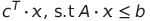
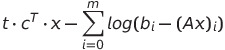

# Randomized solver for Semidefinite Programs
Here are instructions for the tasks that I have implemented for Geomscale as a part for Google Summer of Code 2022. More details about my application as well as example methods can be found in [ProjectProposal.pdf](ProjectProposal.pdf).
## Test 1: Sampling in a polytope.
```
walk="CDHR"
b=c(10,10,10,10,10)
A = matrix(c(1,0,-0.25,-1,2.5,1,0.4,-1,-0.9,0.5), nrow=5, ncol=2, byrow = TRUE)
P = Hpolytope(A = A, b = b)
points = sample_points(P, 1000)
plot(ggplot(data.frame( x=points[1,], y=points[2,] )) +
geom_point( aes(x=x, y=y, color=walk)) + coord_fixed(xlim = c(-15,15),
ylim = c(-15,15)) + ggtitle(sprintf("Sampling a random pentagon with walk %s", walk)))
```

## Test2:Sample from the boundary of a Spectrahedron
We implement the Stochastic Billiards algorithm [1] form boundary sampling over spectrahedra. The example is located in the folder [spectrahedron-boundary-sampling](/examples/spectrahedron-boundary-sampling).


## Test 3: Interior Point Method for Linear Programming.

We implement simple C++ program for the optimization of Linear Programs in the folder [LinearProgramming](/examples/LinearProgramming).
Our implementation uses a logarithmic barrier along with the Newton method [2]. So for solving the problem , we minimize the function:
 for multiplicatively increasing values of t, using Newton's method.

[1] A. B. Dieker and S. Vempala, "Stochastic billiards for sampling from the boundary of a convex set", 2014

[2] S. Boyd and L. Vandenberghe, "Convex Optimization". Cambridge University Press, 2004

# A comparative study of uniform high dimensional samplers

## Compair random walks on the 100-dimensional hypercube.
After sampling 1000 points for every walk we project on the first two coordinates and essentially comment on their mixing time.
```
for (step in c(1,20,50,100,150)){
  for (walk in c("CDHR", "RDHR", "BaW")){
    P <- gen_cube(100, 'H')
    points <- sample_points(P, 1000, random_walk = list("walk" = walk, "walk_length" = step))
    jpeg(file=paste(step,walk,'.jpg'));
    g<-plot(ggplot(data.frame( x=points[1,], y=points[2,] )) +
geom_point( aes(x=x, y=y, color=walk)) + coord_fixed(xlim = c(-1,1),
ylim = c(-1,1)) + ggtitle(sprintf("walk length=%s", step)))
dev.off()
  }
}
```
For walk length 1 we can see that neither one of the random walk sampler has reached the mixing time.


For walk length 20 we can see that the CDHR random sampler seems to be closer to the mixing time. While the other walks are far from it.


For walk length 50 we can see that the CDHR random sampler seems to have reached the mixing time. While the other walks still have not.


For walk length 100 we can see that the CDHR and RDHR random sampler has definately reached the mixing time. While the BaW has not yet explored the whole space.


For walk length 150 we can see that all of the samplers seem to produce uniformly distributed points.


So we can see that the order of Walk Types with respect to the mixing time (decreasing order with respect to speed of convergence) is: CDHR, RDHR and BaW.


## Statistical test for convergence of a random walk sampler.
We will use the Gelman-Rubin test for MCMC convergence. This test when given multiple MCMC chains compares in chain variability to the between chain variability.  As all of the coordinates need to be independent and converge to the same distribution we can apply it between them.

```
library(coda)
for (step in c(1,20,50,100,150)){
  for (walk in c("CDHR", "RDHR", "BaW")){
    P <- gen_cube(100, 'H')
    points <- sample_points(P, 1000, random_walk = list("walk" = walk, "walk_length" = step))
    jpeg(file=paste(step,walk,'.jpg'));
    g<-plot(ggplot(data.frame( x=points[1,], y=points[2,] )) +
geom_point( aes(x=x, y=y, color=walk)) + coord_fixed(xlim = c(-1,1),
ylim = c(-1,1)) + ggtitle(sprintf("walk length=%s", step)))
dev.off()
print(sprintf("walk_type=%s walk_length=%s",walk,step))
a=as.mcmc.list(lapply(as.data.frame(t(points)), mcmc));
print(gelman.diag(a,autoburnin = FALSE,multivariate = TRUE))
jpeg(file=paste(step,walk,'gel','.jpg'));
gelman.plot(a,autoburnin = FALSE)
dev.off()
  }

```
The results for the above walks are:

| Walk | Walk length | R |
| :---: | :---: | :---: |
| CDHR | 1 |1.11  |
| RDHR | 1 | 1.55 |
| BaW | 1 | 1.99 |
| CDHR | 20 |  1 |
| RDHR | 20 |  1.06 |
| BaW | 20| 1.11 |
| CDHR | 50 |  1 |
| RDHR | 50 |  1.02 |
| BaW | 50 | 1.05 |
| CDHR | 100 |  1 |
| RDHR | 100 |  1.01 |
| BaW | 100 | 1.02 |
| CDHR | 150 |  1 |
| RDHR | 150 |  1.01 |
| BaW | 150 | 1.02 |

We know that the the walk is close to convergence if the value of the Gelman-Rubin statistic is close to one. From this statistic we can see that we are close to convergence for walk lengths greater than equal to 20 for the CDHR and RDHR walks. And BaW is close to convergence for walk lengths greater than equal to 50.
