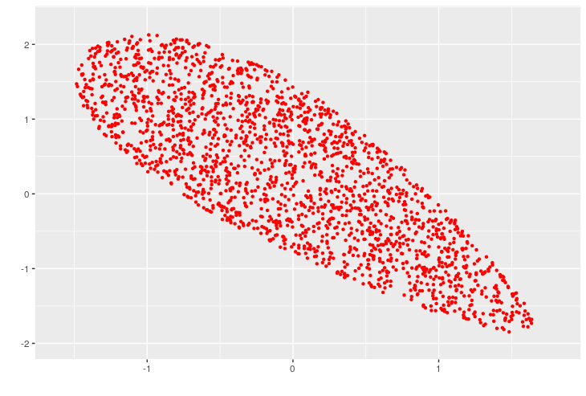
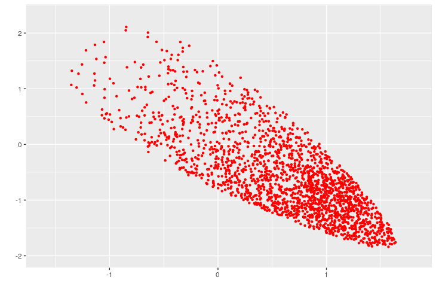

## Volume computation and sampling

**VolEsti** is a C++ library for volume approximation and sampling of convex bodies with an *R* interface.  

#### **This is a development branch that contains the supplementary code for the journal submission of the paper "Sampling  the feasible sets of SDPs and volume approximation".**   

Authors:  
- [Apostolos Chalkis](https://tolischal.github.io) <tolis.chal at gmail.com> 
- [Ioannis Emiris](http://cgi.di.uoa.gr/~emiris/)
- [Vissarion Fisikopoulos](https://vissarion.github.io) <vissarion.fisikopoulos at gmail.com>  
- [Panagiotis Repouskos](https://panagiotisrep.github.io/) < cs1180004 at di.uoa.gr >  
- [Elias Tsigaridas](https://www-polsys.lip6.fr/~elias) <elias.tsigaridas at inria.fr>  

### - R Interface
------------

####  Install Rcpp package  
 
* Install package-dependencies: `Rcpp`, `RcppEigen`, `BH`.  

1. Then use devtools package to install `volesti` Rcpp package. In folder `/root/R-prog` Run:
```r
Rcpp::compileAttributes()  
library(devtools)  
devtools::build()  
devtools::install()  
library(volesti)  
```
2. You can use Rstudio as well to open `volesti.Rproj` and then click `build source Package` and then `Install and Restart` in `Build` at the menu bar.  


####  Run the code from `R`  

* Generate a spectrahedron using the function `generator_sdp(n,m)`.  
  - **Input**:  
    1. `n` is the dimension the spectrahedron lies.  
    2. `m` is the dimension of the matrices in LMI.  
  - **Output**: A txt file with name `sdp_prob_n_m.txt` will be created in folder `/root/R-prog`. You cas use this file (or                 any other with the same format) to give it as input in the following functions.  

* Compute the volume of a spectrahedron using the function `volume()`.  
  - **Input**:  
    1. `filename` is a string with the name of file in the format that the function `generator_sdp()` generates.  
  - **Output**: The function compute the volume of the input spectrahedron by calling the algorithm described in the paper.  
* Sample points from a spectrahedron using the function `sample_points()`.  
  - **Input**:  
    1. `file` is a string with the name of file in the format that the function `generator_sdp()` generates.  
    2. `distribution` is a string to declare from which distribution to sample from: a) `uniform` or b) `boltzmann`. The default value is `uniform`.  
    3. `N` is an integer to declare how many points to sample from the spectrahedron. The default value is `100`.  
    4. `walk_length` is an integer to declare the walk length of the random walk. The default value is `1`.  
    5. `Temperature` is a numeric input to declare the variance of the Boltzamann distribution. The default value is `1`.  
    6. `random_walk` is a string to declare the random walk to use: a) `billiard` for billiard walk, b) `RDHR` for random directions Hit and Run, c) `CDHR` for coordinate directions Hit and Run or d) `HMC` for Hamiltonian Monte Carlo for reflections. The default value `billiard` for the uniform distribution and `HMC` for the Boltzmann distribution.  
  - **Output**: A `nxN` matrix that contains the sampled points columnwise.  

* Approximate the solution of an sdp using the function `sdp_approx()`.  
  - **Input**:  
    1. `filename` is a string with the name of file in the format that the function `generator_sdp()` generates.  
    2. `N`is an integer to declare how many iterations to perform. The default value is `20`.  
    3. `random_walk` is a string to declare the random walk to use: a) `HMC` for Hamiltonian Monte Carlo for reflections or b) `RDHR` for random directions Hit and Run. The default value is `HMC`.  
    4. `walk_length` is an integer to declare the walk length of the random walk. The default value is `1`.  
    
  - **Output**:  A `N`-dimensional vector with the values of the objective function of each iteration.  

* Example:  

```{r}
library(ggplot2)
library(volesti)

> generator_sdp(2,6)

> uniform_points = sample_points('sdp_prob_2_6.txt', N=2000)
> ggplot(data.frame(x = uniform_points[1,], y = uniform_points[2,]),aes(x=x, y=y)) +
       geom_point(shape=20,color="red") +labs(x =" ", y = " ")+xlim(-1.6, 1.8)+ylim(-2,2.3)
 
> boltz_points = sample_points('sdp_prob_2_6.txt', N=2000, distribution = 'boltzmann', Temperature = 2)
> ggplot(data.frame(x = boltz_points[1,], y = boltz_points[2,]),aes(x=x, y=y)) +
   geom_point(shape=20,color="red") +labs(x =" ", y = " ")+xlim(-1.6, 1.8)+ylim(-2,2.3)

> volume('sdp_prob_2_6.txt')
[1] 4.649064
```

The generated spectrahedron from the above `R` script ('sdp_prob_2_6.txt') can be found in both folders `/root/R-prog` and `/root/test`. The script generates the following figures:  



### - C++ Interface
------------

####  Compile C++ sources and run tests 

To compile the C++ code run in folder `/root/test`:  
```
cmake .  
make  
```

####  Run the code from terminal  

* Generate a spectrahedron by running:  
`
./generate -n <dimension> -m <matrix_dimension>
`
A txt file with name `sdp_prob_n_m.txt` will be created in folder `/root/test`. You cas use this file (or any other with the same format) to give it as input in the following function.  

* Compute the volume of a spectrahedron by running:  
`
./vol -file <filename>
`
- Example:  
`./generate -n 2 -m 6`  
`./vol -file sdp_prob_2_6.txt`  
The function prints the volume.  

* Sample points from a spectrahedron by running:  
`
./vol -file <filename> -sample
`
  
- The default settings are: `100` uniformly distributed points from the uniform distribution using billiard walk with walk length `1`.  
- You can use the following flags: i) `-walk_length <walk_length>` to set the walk length of the random walk, ii) `-N <number_of_points>` to set the number of points to sample, iii) `-boltz` to sample from the Boltzmann distribution, iv) `-rdhr` to sample with random directions Hit and Run, `-cdhr` to sample with coordinate directions Hit and Run, `-hmc` to sample with Hamiltonian Monte Carlo with reflections, `-temperature <variance_of_boltzmann_distribution>` to set the variance of the Boltzmann distribution.  

- Example:  
`./generate -n 2 -m 6`  
`./vol -file sdp_prob_2_6.txt -sample -N 200 -rdhr -boltz -temperature 0.5`  
The function prints the sampled points.  

* Approximate the solution of an sdp by running:  
`
./vol -file <filename> -sdp
`
- The default settings are: `20` iterations are performed, with HMC sampling with walk length equal to `1`.  
- You can use the following flags: i) `-N <number_of_iterations>` to set the number of iterations, ii) `-walk_length  <walk_length>` to set the walk length of the random walk iii) `-rdhr` to sample with random directions Hit and Run, `-hmc` to sample with Hamiltonian Monte Carlo with reflections.  

- Example:  
`./generate -n 10 -m 16`  
`./vol -file sdp_prob_10_16.txt -sdp -N 30 -hmc -walk_length 3`  
The function prints the values of the objective function of each iteration.

