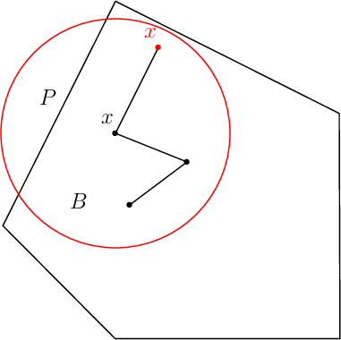
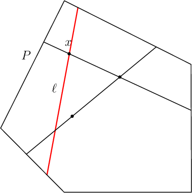
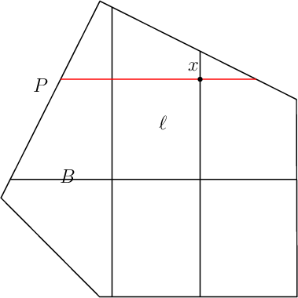
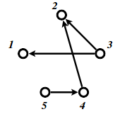

# Essential volesti tutorial

> This is a merge of a series of volesti tutorials presented in university courses and seminars in 2016-2018.

`volesti` is a `C++` package (with an `R` interface) for computing estimations of volume of polytopes given by a set of points or linear inequalities or Minkowski sum of segments (zonotopes). There are two algorithms for volume estimation and algorithms for sampling, rounding and rotating polytopes.

We can download the `R` package from https://CRAN.R-project.org/package=volesti

```r
# first load the volesti library
library(volesti)
packageVersion("volesti")
```

You have access to the documentation of volesti functions like volume computation and sampling.

```r
help("volume")
help("sample_points")
```

## Sampling


Sampling in the square.

```r
library(ggplot2)
P = GenCube(2, 'H')
points1 = sample_points(P, WalkType = "RDHR", walk_step = 1, N=1000)
g<-ggplot(data.frame( x=points1[1,], y=points1[2,] )) + geom_point( aes(x=x, y=y))
g<-g+annotate("path",
   x=cos(seq(0,2*pi,length.out=100)),
   y=sin(seq(0,2*pi,length.out=100)),color="red")+coord_fixed()
plot(g)
```

Naive Monte Carlo fails in (not so) high dimensions.

```r
for (d in 2:20) {
  P = GenCube(d, 'H')

  num_of_points <- 100000
  count_inside <- 0
  tim1 = system.time({ points1 = sample_points(P, WalkType = "RDHR", walk_step = 1, N=num_of_points) })

  for (i in 1:num_of_points) {
    if (norm(points1[,i], type="2") < 1) {
      count_inside <- count_inside + 1
    }
  }
  vol_estimation <- count_inside*2^d/num_of_points
  vol_exact <- pi^(d/2)/gamma(d/2+1)

  cat(d, vol_estimation, vol_exact, abs(vol_estimation- vol_exact)/ vol_exact, "\n")
}
```

## Sampling via random walks


`volesti` supports 3 types of random walks

1. Ball walk



2. Random directions hit-and-run



3. Coordinate directions hit-and-run



There are two important parameters `cost per step` and `mixing time` that affects the accuracy and performance of the walks. Below we illustrate this by choosing different walk steps for each walk while sampling on the 100-dimensional cube.


```r
library(ggplot2)
library(volesti)
for (step in c(1,20,100,150)){
  for (walk in c("CDHR", "RDHR", "BW")){
    P <- GenCube(100, 'H')
    points1 <- sample_points(P, WalkType = walk, walk_step = step, N=1000)
    g<-plot(ggplot(data.frame( x=points1[1,], y=points1[2,] )) + geom_point( aes(x=x, y=y, color=walk)) + coord_fixed(xlim = c(-1,1), ylim = c(-1,1)) + ggtitle(sprintf("walk length=%s", step, walk)))
  }
}
```

## Volume estimation


Now let's compute our first example. The volume of the 3-dimensional cube.

```r
library(geometry)

PV <- GenCube(3,'V')
str(PV)

#P = GenRandVpoly(3, 6, body = 'cube')
tim1 <- system.time({ geom_values = convhulln(PV$V, options = 'FA') })
tim2 <- system.time({ vol2 = volume(PV) })

cat(sprintf("exact vol = %f\napprx vol = %f\nrelative error = %f\n",
            geom_values$vol, vol2, abs(geom_values$vol-vol2)/geom_values$vol))
```

Now try a higher dimensional example. By setting the `error` parameter we can control the apporximation of the algorithm.

```r
PH = GenCube(10,'H')
volumes <- list()
for (i in 1:10) {
  # default parameters
  volumes[[i]] <- volume(PH, error=1)
}
options(digits=10)
summary(as.numeric(volumes))
```

```r
volumes <- list()
for (i in 1:10) {
  volumes[[i]] <- volume(PH, error=0.5)
}
summary(as.numeric(volumes))
```

Deterministic algorithms for volume are limited to low dimensions (e.g. less than $15$)

```r
library(geometry)

P = GenRandVpoly(15, 30)
# this will return an error about memory allocation, i.e. the dimension is too high for qhull
tim1 <- system.time({ geom_values = convhulln(P$V, options = 'FA') })

#warning: this also takes a lot of time in v1.0.3
print(volume(P))
```

### Volume of Birkhoff polytopes


We now continue with a more interesting example, the 10-th Birkhoff polytope. It is known from https://arxiv.org/pdf/math/0305332.pdf that its volume equals

$\text{vol}(\mathcal{B}_{10}) = \frac{727291284016786420977508457990121862548823260052557333386607889}{828160860106766855125676318796872729344622463533089422677980721388055739956270293750883504892820848640000000}$

obtained via massive parallel computation.

```r
library(volesti)
P <- fileToMatrix('data/birk10.ine')
exact <- 727291284016786420977508457990121862548823260052557333386607889/828160860106766855125676318796872729344622463533089422677980721388055739956270293750883504892820848640000000

# warning the following will take around half an hour
#print(volume(P, Algo = 'CG'))
```

Compare our computed estimation with the "normalized" floating point version of  $\text{vol}(\mathcal{B}_{10})$

```r
n <- 10
vol_B10 <- 727291284016786420977508457990121862548823260052557333386607889/828160860106766855125676318796872729344622463533089422677980721388055739956270293750883504892820848640000000
print(vol_B10/(n^(n-1)))
```


## Rounding


We generate skinny polytopes, in particular skinny cubes of the form $\{x=(x_1,\dots,x_d)\ |\ x_1\leq 100, x_1\geq-100,x_i\leq 1,x_i\geq-1,x_i\in \mathbb{R}, \text{ for } i=2,\dots,d\}$.

Our random walks perform poorly on those polytopes espacially as the dimension increases. Note that if we use the `CDHR` walk here is cheating since we take advanatage of the instance structure.

```r
library(ggplot2)

P = GenSkinnyCube(2)
points1 = sample_points(P, WalkType = "CDHR", N=1000)
ggplot(data.frame(x = c(points1[1,]), y = c(points1[2,])), aes(x=x, y=y)) + geom_point() +labs(x =" ", y = " ")+coord_fixed(ylim = c(-10,10))
points1 = sample_points(P, WalkType = "RDHR", N=1000)
ggplot(data.frame(x = c(points1[1,]), y = c(points1[2,])), aes(x=x, y=y)) + geom_point() +labs(x =" ", y = " ")+coord_fixed(ylim = c(-10,10))
```

```r
P = GenSkinnyCube(10)
points1 = sample_points(P, WalkType = "CDHR", N=1000)
ggplot(data.frame(x = c(points1[1,]), y = c(points1[2,])), aes(x=x, y=y)) + geom_point() +labs(x =" ", y = " ")+coord_fixed(xlim = c(-100,100), ylim = c(-10,10))
points1 = sample_points(P, WalkType = "RDHR", N=1000)
ggplot(data.frame(x = c(points1[1,]), y = c(points1[2,])), aes(x=x, y=y)) + geom_point() +labs(x =" ", y = " ")+coord_fixed(xlim = c(-100,100), ylim = c(-10,10))
P = GenSkinnyCube(100)
points1 = sample_points(P, WalkType = "RDHR", N=1000)
ggplot(data.frame(x = c(points1[1,]), y = c(points1[2,])), aes(x=x, y=y)) + geom_point() +labs(x =" ", y = " ")+coord_fixed(xlim = c(-100,100), ylim = c(-10,10))
```


Then we examine the problem of rounding by sampling in the original and then in the rounded polytope and look at the effect in volume computation.

```r
library(ggplot2)

d <- 10

P = GenSkinnyCube(d)
points1 = sample_points(P, WalkType = "CDHR", N=1000)
ggplot(data.frame(x = c(points1[1,]), y = c(points1[2,])), aes(x=x, y=y)) + geom_point() +labs(x =" ", y = " ")+coord_fixed(ylim = c(-10,10))

P <- rand_rotate(P)$P

points1 = sample_points(P, WalkType = "RDHR", N=1000)
ggplot(data.frame(x = c(points1[1,]), y = c(points1[2,])), aes(x=x, y=y)) + geom_point() +labs(x =" ", y = " ")+coord_fixed()

exact <- 2^d*100
cat("exact volume                 = ", exact , "\n")
cat("volume estimation (no round) = ", volume(P, WalkType = "RDHR", rounding=FALSE), "\n")
cat("volume estimation (rounding) = ", volume(P, WalkType = "RDHR", rounding=TRUE), "\n")

# 1st step of rounding
res1 = round_polytope(P)
points2 = sample_points(res1$P, WalkType = "RDHR", N=1000)
ggplot(data.frame(x = c(points2[1,]), y = c(points2[2,])), aes(x=x, y=y)) + geom_point() +labs(x =" ", y = " ")+coord_fixed()
volesti <- volume(res1$P) * res1$round_value
cat("volume estimation (1st step) = ", volesti, " rel. error=", abs(exact-volesti)/exact,"\n")

# 2nd step of rounding
res2 = round_polytope(res1$P)
points2 = sample_points(res2$P, WalkType = "RDHR", N=1000)
ggplot(data.frame(x = c(points2[1,]), y = c(points2[2,])), aes(x=x, y=y)) + geom_point() +labs(x =" ", y = " ")+coord_fixed()
volesti <- volume(res2$P) * res1$round_value * res2$round_value
cat("volume estimation (2nd step) = ", volesti, " rel. error=", abs(exact-volesti)/exact,"\n")

# 3rd step of rounding
res3 = round_polytope(res2$P)
points2 = sample_points(res3$P, WalkType = "RDHR", N=1000)
ggplot(data.frame(x = c(points2[1,]), y = c(points2[2,])), aes(x=x, y=y)) + geom_point() +labs(x =" ", y = " ")+coord_fixed()
volesti <- volume(res3$P) * res1$round_value * res2$round_value * res3$round_value
cat("volume estimation (3rd step) = ", volesti, " rel. error=", abs(exact-volesti)/exact,"\n")
```


## Integration


We can use sampling and volume estimation to estimate integrals over polyhedral domains. Below there is an example with a degree 2 polynomial over a 3-dimensional cube.

```r
library(cubature) # load the package "cubature"
f <- function(x) { 2/3 * (2 * x[1]^2 + x[2] + x[3]) + 10 }  # "x" is vector
adaptIntegrate(f, lowerLimit = c(-1, -1, -1), upperLimit = c(1, 1, 1))$integral

# Simple Monte Carlo integration
# https://en.wikipedia.org/wiki/Monte_Carlo_integration
P = GenCube(3, 'H')
num_of_points <- 10000
points1 <- sample_points(P, WalkType = "RDHR", walk_step = 100, N=num_of_points)
int<-0
for (i in 1:num_of_points){
  int <- int + f(points1[,i])
}
V <- volume(P)
print(int*V/num_of_points)
```

## Counting linear extensions


Let $G= (V, E)$ be an acyclic digraph with $V= [n] :=\{1,2, . . . , n\}$. One might want to consider $G$ as a representation of the partially ordered set (poset) $V:i > j$ if and only if there is a directed path from node $i$ to node $j$.A permutation $\pi$ of $[n]$ is called a linear extension of $G$ (or the associated poset $V$) if $\pi^{−1}(i)> \pi^{−1}(j)$ for every edge $i\rightarrow j \in E$.

Let $P_{LE}(G)$ be the polytope in $\mathbb R^n$ defined by $P_{LE}(G)$ $=\{x\in \mathbb R^n\ |\ 1\geq x_i \geq 0 \text{ for all } i=1,2,\dots ,n\}$ and $x_i\geq x_j$ for all directed edges $i\rightarrow j \in E$.

A well known result is that the number of linear extensions of $G$ is $vol(P)*n!$.

The following example from [notes](https://inf.ethz.ch/personal/fukudak/lect/pclect/notes2016/expoly_order.pdf) has $9$ linear extensions. See also [this paper](https://www.aaai.org/ocs/index.php/AAAI/AAAI18/paper/viewFile/16957/15838) for counting linear extensions in practice.



We can approximate this number by the following code.

```r
A = matrix(c(-1,0,1,0,0,0,-1,1,0,0,0,-1,0,1,0,0,0,0,-1,1,1,0,0,0,0,0,1,0,0,0,0,0,1,0,0,0,0,0,1,0,0,0,0,0,1,-1,0,0,0,0,0,-1,0,0,0,0,0,-1,0,0,0,0,0,-1,0,0,0,0,0,-1), ncol=5, nrow=14, byrow=TRUE)
b = c(0,0,0,0,0,0,0,0,0,1,1,1,1,1)
P = Hpolytope$new(A, b)
volume(P,error=0.2)*factorial(5)
```
