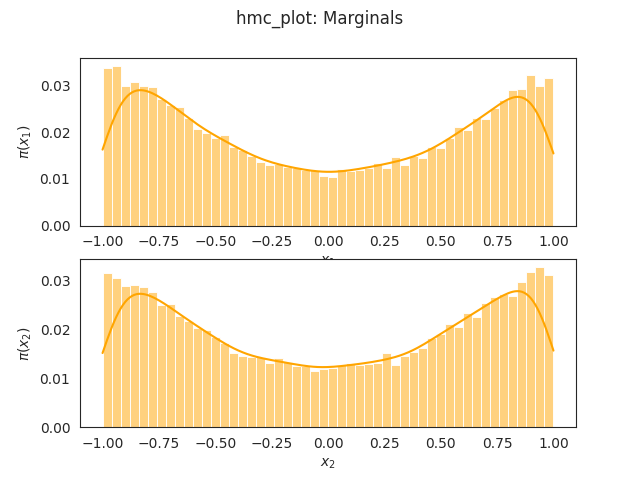
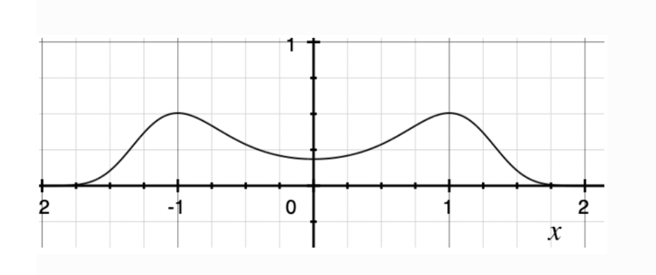
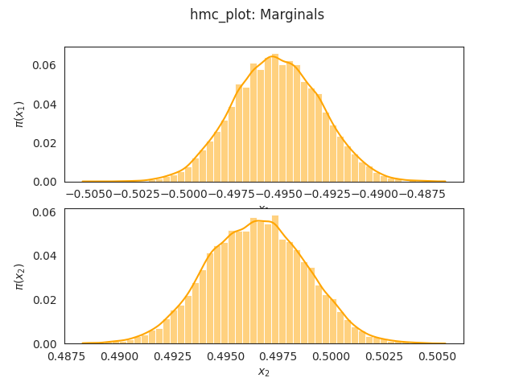

## Installation of the required libraries
C++ 17 is required

The offical installation guide for Autodiff can be found [here](
https://autodiff.github.io/installation/ ). Here are sme useful links for installing some prerequisites for Autodiff library([Catch2 issue1](https://github.com/etaler/Etaler/issues/33),[Catch2 issue2](https://stackoverflow.com/questions/65098604/catch2-installation-on-ubuntu-20-04-include-catch2-catch-hpp
),[libeigen3-dev](https://zoomadmin.com/HowToInstall/UbuntuPackage/libeigen3-dev),[pybind11](https://stackoverflow.com/questions/46961942/pybind11-linux-building-tests-failure-could-not-find-package-configuration-fi ))


### Background information
Autopoint is implemented using AUtodiff Library , after experiments of comparing various automatic differentiating libraries.Read [here](https://gist.github.com/zhanggiene/8471601fa25ba9db90303661b0e2237b) to find out more!

### Steps to run the four examples


### 1. User defined function where the pdf function is explicitly defined by the user. 

``` 
./userDefinedFunction_autopoint > userDefinedFunction_autopoint.txt

python plot_hmc.py < userDefinedFunction_autopoint.txt
```
Here is the histogram of samples from user defined distribution.It is the same as the real pdf of the distribution when -1<x<1 since sampling is done is in truncated space.


here is the density plot of the real distribution.


### 2. The pdf is defined using a mixture of gaussian distribution with data
1. generate data from the mixture of gaussian distribution
```
python generate_gaussian_mixture_data.py > data.txt
```
2. Data from the true distribution is used to define the pdf. 
```
./Gaussian_mixture_autopoint > Gaussian_mixture.txt
```
3. Plot the graph
```
python plot_hmc.py < Gaussian_mixture.txt
```



### 3.The pdf is defined using logistic regression using data
The data comes from the real world [dataset](https://archive.ics.uci.edu/ml/datasets/banknote+authentication).

The first column of all 1 is the data added after preprocessing, it is meant to represent the bias term in the model. the last column is the value of the category.

1. Sampling from pdf defined using real world data and store the samples of the parameters
```
./Logistic_regression_autopoint > Logistic_regression.txt
```
2. plot the histogram of all sampled data points
```
python plot_hmc.py < Logistic_regression.txt
```
The result is comparable to other machine learning method


### 3.The pdf is defined using a mixture of multi-dimensional gaussian distribution with multi-dimensional data. 

1. Generate data points from mixture of multi-dimensional gaussian distribution
```
python generate_gaussian_mixture_data.py > data.txt
```
2. Conduct hmc sampling

```
./MultidimensionalGaussian_mixture_autopoint
```
### Points to take note
it is advised to use NutsHamiltonianMonteCarloWalk instead of HamiltonianMonteCarloWalk.

In StanMath library, the gradient is stored in double data type.
