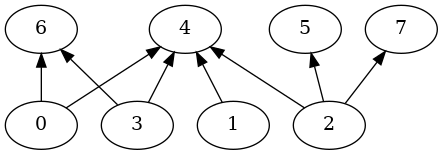
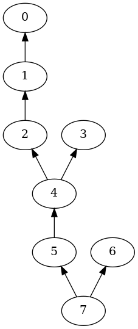

## Compilation
In folder examples, first run cmake, to create the makefile:

```bash
cmake .
```

Then, in folder examples/count-linear-extensions-using-hpolytope compile and build using the makefile:

```bash
make
```

## Usage:
```bash
 ./volesti_lecount INSTANCE VOLUME_METHOD ROUNDING_METHOD 
```
_Note:_ (ROUNDING_METHOD is optional) 

**Example: for (volume method = sequence of balls, rounding method = SVD)**
```bash
 ./volesti_lecount instances/bipartite_0.5_008_0.txt sob SVD  
```

## Sample instances:
Currently the example contains two poset instances available as adjacency matrix of their respective DAG's (**D**irected **A**cyclic **G**raph).
The instances are as follows:
- [Bipartite Graph](https://en.wikipedia.org/wiki/Bipartite_graph) with 8 elements  
  
**Exact number of linear extensions: 1504**  

- [Bayesian Network for Andes model](https://www.bnlearn.com/bnrepository/) with 8 elements  
  
**Exact number of linear extensions: 28**  

Both instances are generated and visualized using scripts given in this [repo](https://github.com/ttalvitie/le-counting-practice).
