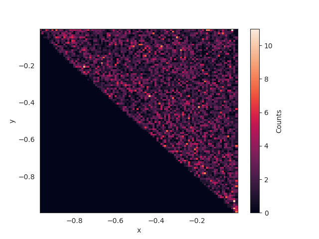
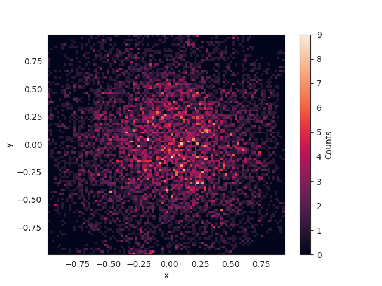

## Constrained Riemannian Hamiltonian Monte Carlo for Polytopes
This is an example that illustrates sampling from the random walk for the hypercube.

References:
Yunbum Kook, Yin Tat Lee, Ruoqi Shen, Santosh S. Vempala. "Sampling with Riemannian Hamiltonian
 Monte Carlo in a Constrained Space"
## Compilation
Build the example by running the following commands in this directory.

```bash
cmake . -DLP_SOLVE=_PATH_TO_LIB_FILE
make
```  
You have to specify the path to liblpsolve55.so.  
For example: -DLP_SOLVE=/usr/lib/lpsolve/liblpsolve55.so

## Running:
```bash
 ./simple_crhmc 4 1000 500 2
  python3 ../python_utilities/plot_samples.py <CRHMC_SIMD_4_simplex_samples.txt --save
```

## Example Output
|2D Simplex Uniform|2D Cube Gaussian|
|:-:|:-:|
|||
