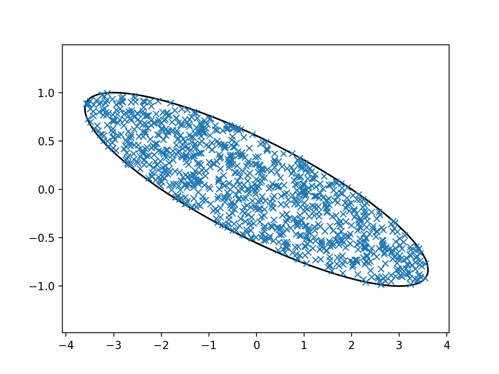

## Compilation
In folder examples, first run cmake, to create the makefile:

```bash
cmake .
```

Then, in folder examples/ellipsoid-sampling compile and build using the makefile:

```bash
make
```

## Usage:
```bash
 ./ellipsoid2d-sampling > ellipsoid.txt
```
After this, you can run `python3 plot_pts.py` to plot the sampled points.

## Sample instance:
The ellipsoid is in the form: `(x-c)' A (x-c) <= 1`, where `A = LL'`, currently there is only sample instance (number of sample points = 1000)  
```
L = [0.5, 0,  
     1.5, 1.0]; 
```

**Sampled points:**  
  
