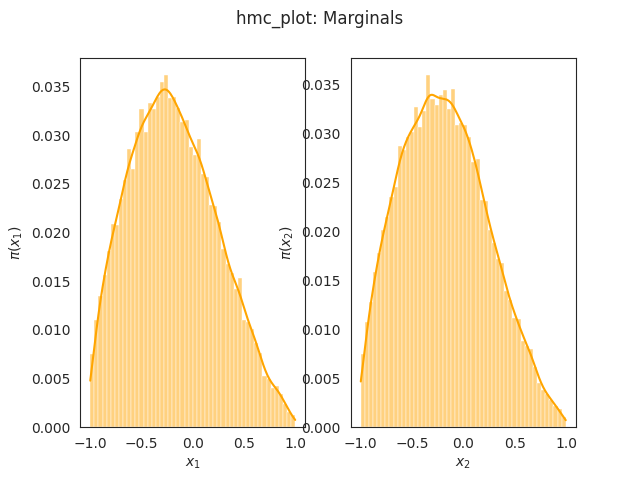
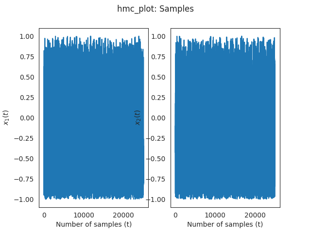
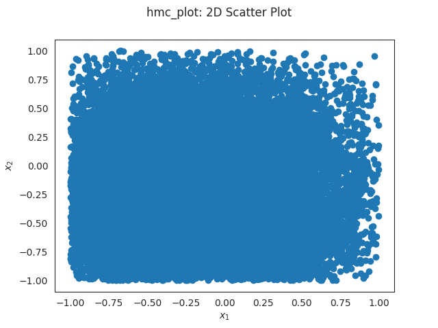

# Running the Examples
Build the example by running the following commands in this directory.

```
cmake .. -DEXAMPLES=logconcave
make
```

Now, you can the HMC and ODE examples and generate their outputs
```
./simple_hmc >hmc_samples.txt
./simple_ode >ode_points.txt
```

For plotting the results there are two scripts
 * `plot_hmc.py` for plotting the outputs of the HMC sampler
 * `plot_ode.py` for plotting the outputs of the ODE solver

These scripts have requirements listed in `requirements.txt`. Install via
```
pip install -r requirements.txt
```

Plot the results as
```
  python plot_hmc.py <hmc_samples.txt
  python plot_ode.py <ode_points.txt
```

You can also use the `--limits` argument to set {x, y, z}-limits for the joint plots.

## Example Results

We sample with a negative log-density equal to  `f(x) = 2 * x^T x + sum(x)`, using 3 integrator steps
with step size 0.23 and draw 50000 samples, buring 25000.

**Marginals**



**Samples**



**Scatter Plot**


