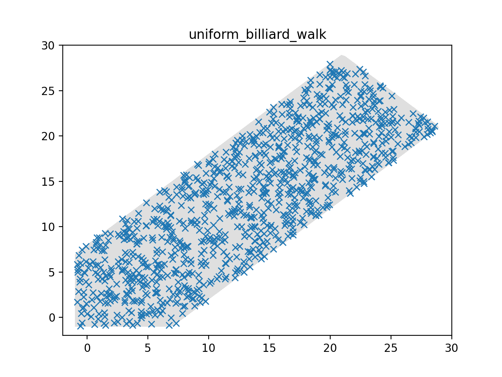
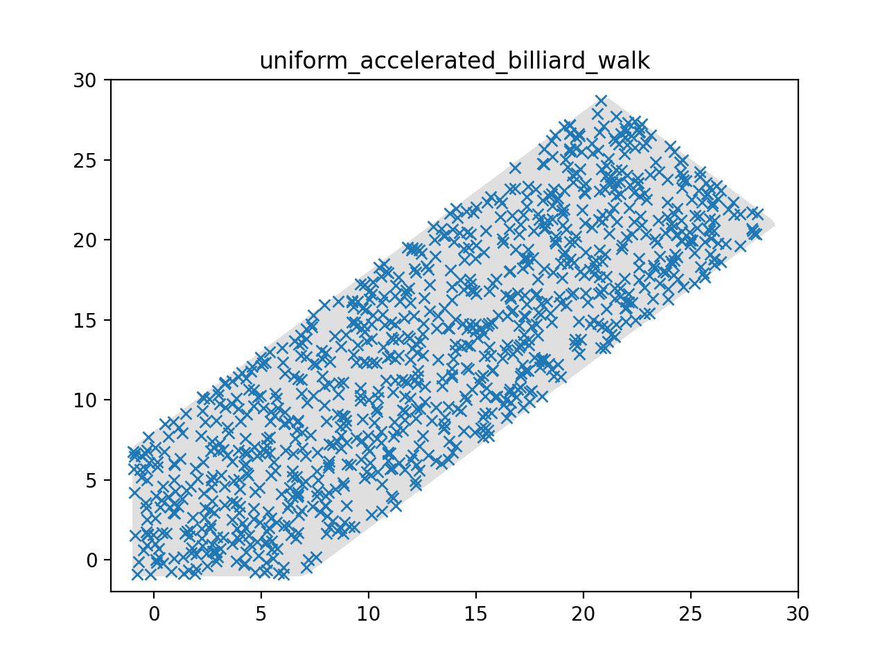
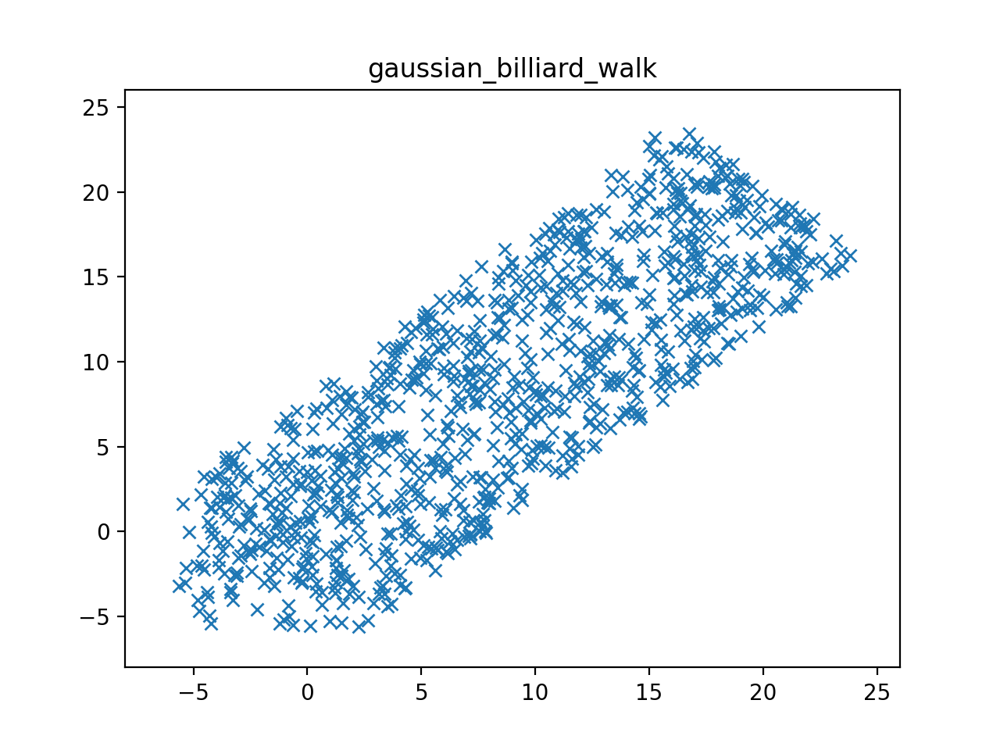

## Compilation
In folder examples, first run cmake, to create the makefile:

```bash
cmake .
```

Then, in folder examples/sampling-hpolytope-with-billiard-walks compile and build using the makefile:

```bash
make
```

## Usage:
```bash
 ./sampler
```
After this, you can run `python3 plot.py` to plot the sampled points.

## Sample instance:
Currently there is only sample instance (number of sample points = 1000) in the form `Ax<=b`, representing the following inequalities
```
x >= -1
y >= -1
x-y <= 8
x-y >= -8
x+y <= 50
```

**Sampled points:**



