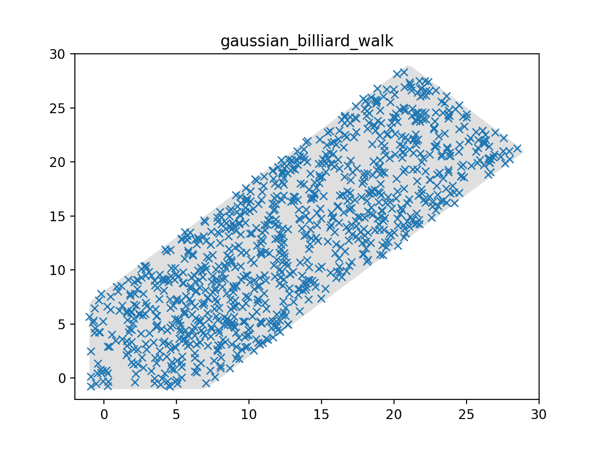

## Compilation
Build the example by running the following commands in this directory.

```bash
cmake . -DLP_SOLVE=_PATH_TO_LIB_FILE
make
```  
You have to specify the path to liblpsolve55.so/dll/dylib.  
For example: -DLP_SOLVE=/usr/lib/lpsolve/liblpsolve55.so

## Usage:
```bash
 ./sampler
```
After this, you can run `python3 plot.py` to plot the sampled points.

## Sample instance:
Currently there is only sample instance (number of sample points = 1000) in the form `Ax<=b`, representing the following inequalities
```
x >= -1
y >= -1
x-y <= 8
x-y >= -8
x+y <= 50
```

**Sampled points:**



