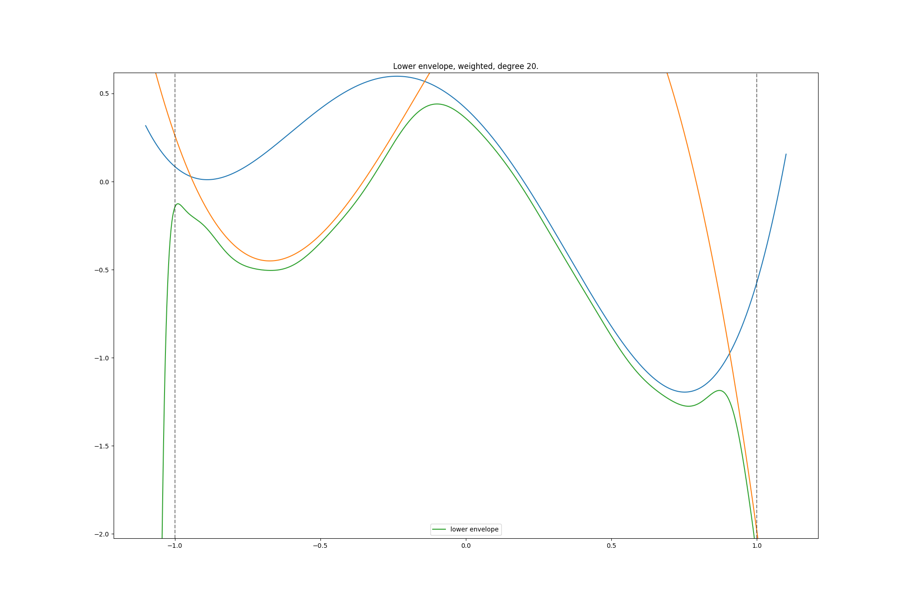

## Sum of Squares optimization

This subproject implements the algorithm(s) in [1,2,3].
Supplementary material describing the mathematical theory behind the code can be found [here](http://personal.lse.ac.uk/natura/gsoc2020/supplementary.pdf)

#### Usage the SOS-solver for Polynomial Envelope problems

For precise computation of Chebyshev Points and Lagrange Polynomials boost::multiprecision is used. Boost is also
used for the Property Tree in instances and configuration as well as for typecasting templated classes. The boost headers in this project do not contain the needed header files. Please provide the link to the boost files (version 1.67 or higher) via thet `-DBOOST_DIR` flag. Also [spdlog](https://github.com/gabime/spdlog) is used. Please provide link to installed package via `-DSPDLOG_DIR` flag. (The link also provides manuals for installation with various package managers.)
Navigate to the SOS envelope example and and compile:

```
cd examples/EnvelopeProblemSOS
cmake -DCMAKE_BUILD_TYPE=Release_double -DBOOST_DIR=your_boost_include_directory -DSPDLOG_DIR=your_spdlog_include_dir .
make
```

Run 

```
./EnvelopeProblemSOS
```

See an example plot below.


To parse a custom file invoke with added file argument:

```
./NonSymmetricConicOptimization file.json
```

where `file.json` has format

``` json
{
    "max_degree": 30,
    "num_variables": 1,
    "polynomials": [
      [1,-1, 3, -4, 7],
      [0.5,2, 8, -3, 5]
    ]
}

```

Each array in "polynomials" stands for a polynomial. The entries of its array a are the coefficients of the first length(a) coefficients in standard monomial basis or Chebyshev basis. The basis choice can be adjusted in the configuration json file.


#### Implemented

* The generic implementation of the algorithm in [1] with barrier methods for the following cones:
    * Non-negative orthant
    * SDP cone
    * Dual of SOS cone with following bases:
        * monomial
        * interpolant   
* Generation of Lagrange polynomials for Chebyshev points of the second kind
* Tool that approximates the polynomial lower envelope of any (stable to degree approx. 100) set of univariate polynomials 
on the interval [-1,1].
* Visualisation via Matplotlib plot.
* Support for several floating-point precision data types for the IPM 
(Primitive Floating Point and boost:multiprecision floats)
* Added multivariate support
* Added multithreading.
* Added LAPACK and BLAS support
* Added MKL Support (system-dependent configuration necessary)
* Dynamically switch between float -> double -> long double -> multiprecision, when Matrices become ill-conditioned.
    Note that this feature currenlty only works for the InterpolantDualSOSBarrier, SumBarrier and ProductBarrier.
* Dynamic step-length for predictor step and size of large neighborhood.
* Input and configuration files in JSON format

#### Roadmap 

* Add switch to use sparse computation (via counting nonzeros in A or other existing funcionality)
* Parameter tuning
* Choose Method for QR Decompositions dynamically. Benchmarks can be found [here](https://eigen.tuxfamily.org/dox/group__DenseDecompositionBenchmark.html).
* Use Eigen funcionality to avoid dynamical heap memory is allocation.
* Implement Lagrange polynomials more efficiently (or find C++ library with sufficient precision.)
* Benchmarking with alfonso, SOSTOOLS, MOSEK (SDP and the new Nonsymmetric cone solver), SeDuMi 
* Implementation/inspiration from  [4]. In particular interesting are:
    * Positive definite rescaling matrix for added stability and monotonicity 
    * Combining Predictor- and Corrector steps.
* Higher order corrector steps as in [1]
* Write more tests
* Test different central path neighborhoods, e.g. measuring \psi in \infty norm. 
* Interfaces for R (and Python)
* Store the gradient and Hessian of the previous iterate (for failing next step in predictor direction)
    * Even better: For all the line steps, compute the new predictor/corrector direction. This is cheap, 
    as we already have gradient and hessian, but might drastically improve performance.
* Fix SDP solver. It returns feasible solutions but no optimal solutions yet.


#### References

[1] A. Skajaa and Y. Ye, [A homogeneous interior-point algorithm for nonsymmetric convex conic optimization](https://web.stanford.edu/~yyye/nonsymmhsdimp.pdf), Mathematical Programming Ser. A, 150 (2015), pp. 391-422. 

[2] D. Papp and S. Yildiz, On “A homogeneous interior-point algorithm for nonsymmetric convex conic optimization”. https://arxiv.org/abs/1712.00492

[3] D. Papp and S. Yildiz, [Sum-of-squares optimization without semidefinite programming](https://arxiv.org/abs/1712.01792). SIAM Journal on Optimization 29(1), 2019, pp. 822-851. 

[4] R. Badenbroek and J. Dahl, [An Algorithm for Nonsymmetric Conic Optimization Inspired by MOSEK](https://arxiv.org/pdf/2003.01546.pdf). https://arxiv.org/pdf/2003.01546.pdf 


